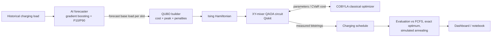
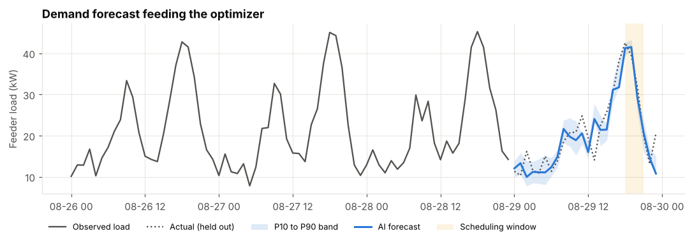
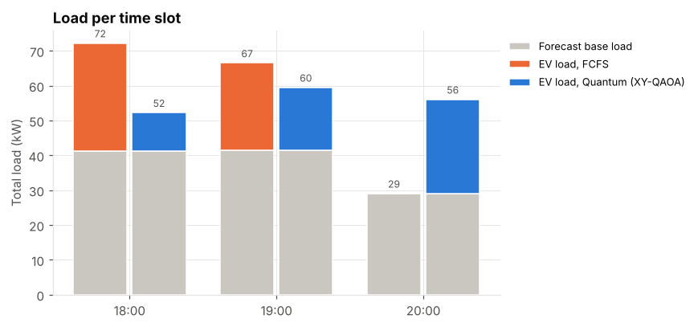
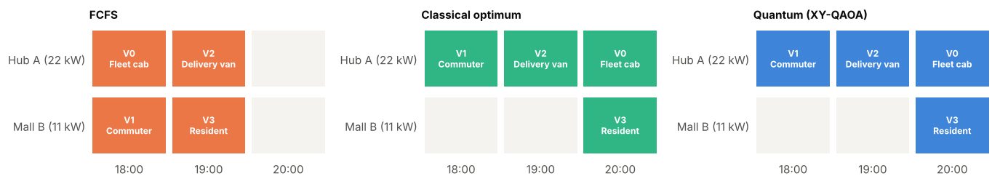
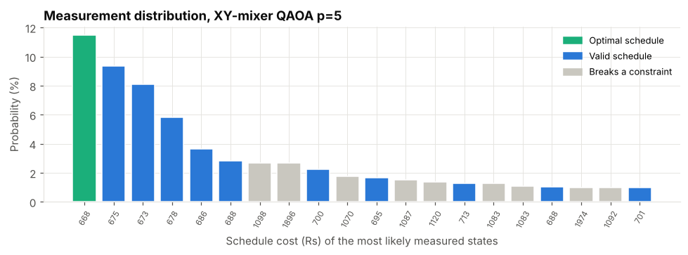
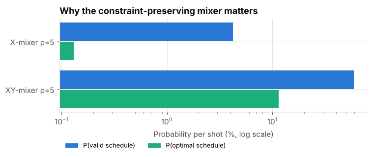
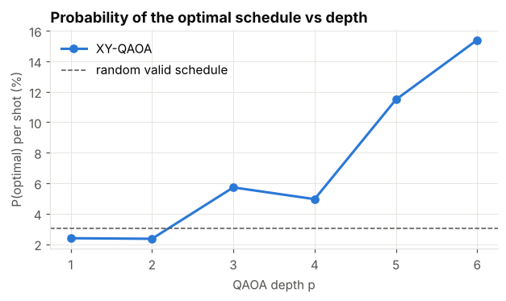
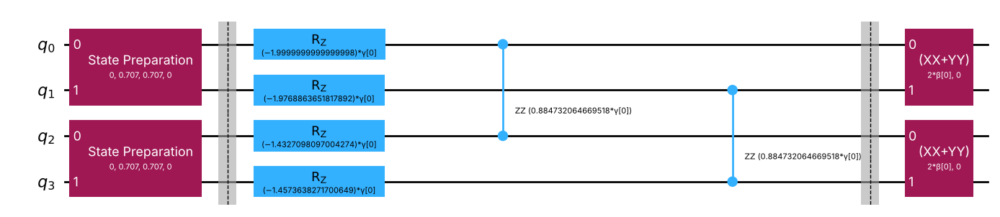

# Quantum EV Charging Optimizer

**Hybrid Quantum + AI scheduling of electric vehicle charging.**
An AI model forecasts charging demand on the grid feeder, and a variational quantum algorithm (QAOA, built on Qiskit) decides **which vehicle charges, at which station, and when**, so that charging congestion, peak grid load and energy cost all go down.

Submission for **QHack 2026, Round 1**.

| | |
|---|---|
| Quantum method | Constraint-preserving QAOA (XY mixer) with CVaR objective, plus standard QAOA for comparison |
| AI method | Gradient-boosted trees with quantile (P10/P90) forecasts |
| Framework | Qiskit 1.x / 2.x, scikit-learn, Streamlit |
| Prototype | Jupyter notebook with runnable quantum circuits, Streamlit dashboard, command line pipeline |

---

## 1. The problem

EV adoption is growing faster than charging infrastructure and local grid capacity.

* **Congestion:** drivers pile into the same chargers at the same time while other chargers sit idle.
* **Grid stress:** uncoordinated charging stacks on top of the evening household peak and overloads feeders and transformers.
* **Cost and waste:** energy is bought in the most expensive time-of-day tariff window.

Deciding when, where and which vehicle charges is a combinatorial scheduling problem. With `V` vehicles, `S` stations and `T` time slots there are up to `(S·T)^V` possible schedules, and the problem is NP-hard in general. This is the class of problem that QAOA and quantum annealing target.

## 2. Our solution



The key link between the AI and quantum halves: the **forecast becomes a coefficient of the Hamiltonian**. A slot where the model predicts heavy background load becomes more expensive to add EV load to, so QAOA's energy landscape changes with the prediction. Switching the planner to the P90 forecast gives a risk-averse schedule with no other code change.

### Why quantum

* The schedule is a binary optimisation problem that maps directly onto qubits (one qubit per allowed vehicle, station, slot choice) and onto an Ising Hamiltonian.
* QAOA is a variational algorithm designed for near-term hardware: shallow circuits run on the quantum device while a classical optimizer tunes the angles.
* Constraint-preserving mixers let the circuit search only over schedules that respect the hard rules, which matters a lot as instances grow (see results).
* The same formulation runs unchanged on quantum annealers (D-Wave) and gate-based hardware (IBM), so the pipeline improves as hardware improves.

## 3. Formulation

Decision variable: `x[v,s,t] = 1` if vehicle `v` charges at station `s` in slot `t`. Variables are only created for physically possible choices (within the vehicle's arrival and deadline window, station power at least the requested energy per slot).

**Cost (Rs)**

```
H_cost = Σ_{v,s,t} ( τ_t·E_v  +  w·(t − arrival_v)  +  δ_{v,s} ) · x[v,s,t]
       + γ · Σ_t ( d̂_t + Σ_{v,s} E_v · x[v,s,t] )²
```

| Symbol | Meaning |
|---|---|
| `τ_t` | time-of-day tariff (Rs/kWh) |
| `E_v` | energy requested by vehicle `v` (kWh, delivered within one 1-hour slot) |
| `w` | cost of making a driver wait one slot |
| `δ_{v,s}` | detour cost if the station is not the driver's preferred one |
| `d̂_t` | **AI forecast** of background feeder load in slot `t` |
| `γ` | peak-shaving weight (Rs per kW², a demand-charge proxy) |

**Constraints as penalties**

```
H_A = A · Σ_v ( 1 − Σ_{s,t} x[v,s,t] )²                    every vehicle charges exactly once
H_B = B · Σ_{s,t} Σ_{v<v'} x[v,s,t] · x[v',s,t]             one vehicle per charger per slot
```

`A = B` is set automatically to 1.5 times the largest saving any single violation can buy, and the test suite checks that the global minimum is always a valid schedule. The QUBO is mapped to an Ising Hamiltonian with `x = (1 − z)/2`.

## 4. Quantum algorithm

| Component | Choice | Why |
|---|---|---|
| Initial state | W state per vehicle (one-hot superposition) | Starts inside the space of "charge exactly once" schedules |
| Cost layer | `RZ` and `RZZ` rotations from the Ising coefficients | Standard QAOA phase separator |
| Mixer | XY ring mixer (`XX+YY` gates) inside each vehicle's block | Moves a vehicle between its options without ever breaking the one-hot rule (Hadfield et al., 2019) |
| Objective | CVaR at alpha = 0.25 | Focuses training on the best outcomes, which is what a sampler returns (Barkoutsos et al., 2020) |
| Classical optimizer | Grid search for p = 1, then COBYLA; depth grown layer by layer with INTERP warm start | Avoids poor local minima at higher depth (Zhou et al., 2020) |
| Execution | Trained circuit run on Qiskit `StatevectorSampler`, 4096 shots | Best valid measured bitstring becomes the schedule |

For comparison the repo also runs **standard QAOA** (Hadamard start, `RX` mixer, all constraints as penalties) on the same Hamiltonian.

To keep the training loop fast, cost evaluations use a small vectorised simulator that applies exactly the same gates. After training, the real Qiskit circuit is simulated and its state is compared with the fast simulator; the fidelity is reported in every run (it is 1.0 to machine precision).

## 5. Results (demo instance: 4 vehicles, 2 stations, 3 evening slots, 15 qubits)

Forecaster on a held-out week: **MAE 2.34 kW** versus 3.28 kW for the seasonal-naive baseline (**29% better**).

| Method | Valid | Peak load (kW) | Energy cost (Rs) | Avg wait (slots) | Detour (Rs) | Total objective (Rs) |
|---|---|---|---|---|---|---|
| First-come-first-served | yes | 72.2 | 507.0 | 0.25 | 20 | 751.8 |
| Exact optimum (brute force) | yes | 59.5 | 419.5 | 1.00 | 0 | 667.8 |
| **XY-QAOA, p = 5** | **yes** | **59.5** | **419.5** | 1.00 | **0** | **667.8** |
| Simulated annealing | yes | 59.5 | 419.5 | 1.00 | 0 | 667.8 |

**XY-QAOA finds the exact optimum: 17.6% lower peak feeder load and 17.3% lower energy cost than FCFS, with every vehicle charged before its deadline.** The trade-off is a modest increase in average waiting, which the optimizer accepts because the 20:00 slot is cheaper and the grid is less loaded.

| Quantum solver (p = 5) | Qubits | CX gates | P(valid schedule) per shot | P(optimal schedule) per shot |
|---|---|---|---|---|
| **XY-mixer QAOA** | 15 | 523 | **58.8%** | **11.5%** |
| Standard X-mixer QAOA | 15 | 510 | 4.2% | 0.13% |
| Random valid schedule (reference) | | | | 3.0% |

The constraint-preserving mixer puts **14x more shots on valid schedules** and **88x more shots on the optimal schedule** than standard QAOA at the same depth. The notebook also shows how P(optimal) grows with depth (2.4% at p = 1 up to 15.4% at p = 6).

| | |
|---|---|
|  |  |
|  |  |
|  |  |

One XY-QAOA layer on the 4-qubit toy instance:



## 6. Repository structure

```
ev-quantum-charging/
├── README.md
├── requirements.txt
├── app.py                         Streamlit dashboard
├── run_pipeline.py                command line pipeline, writes results/
├── notebooks/
│   └── EV_Quantum_Charging_Demo.ipynb   full walkthrough with runnable circuits (outputs included)
├── evq/
│   ├── data.py                    synthetic charging-site load
│   ├── forecast.py                demand forecaster (P10 / P50 / P90)
│   ├── problem.py                 instances, QUBO builder, metrics
│   ├── qaoa.py                    QAOA circuits, XY mixer, CVaR training, sampling
│   ├── baselines.py               FCFS, brute force, simulated annealing
│   ├── pipeline.py                end-to-end run
│   └── viz.py                     figures
├── tests/
│   └── test_core.py               correctness checks
└── results/                       figures and tables from the last run
```

## 7. Setup

Requires **Python 3.10 or newer**.

```bash
# 1. clone
git clone https://github.com/MinalVP0824/ev-quantum-charging.git
cd ev-quantum-charging

# 2. create a virtual environment
python -m venv .venv
# Windows
.venv\Scripts\activate
# macOS / Linux
source .venv/bin/activate

# 3. install dependencies
pip install -r requirements.txt

# 4. check everything works (about 1 second)
python -m pytest -q
```

## 8. Running the prototype

**Jupyter notebook (recommended for reviewing the quantum part)**

```bash
jupyter notebook notebooks/EV_Quantum_Charging_Demo.ipynb
```

Run all cells. Total runtime is about 1.5 minutes on a laptop. The notebook is committed with its outputs, so it can also be read directly on GitHub.

**Dashboard**

```bash
streamlit run app.py
```

Choose the problem size, QAOA depth, CVaR alpha, peak weight and forecast mode (expected or P90) in the sidebar, then press *Run optimizer*. The demo instance takes about 15 to 40 seconds.

**Command line**

```bash
python run_pipeline.py                     # demo instance, p = 5
python run_pipeline.py --instance toy      # 4 qubits, instant
python run_pipeline.py --instance large    # 5 vehicles, 19 qubits, a few minutes
python run_pipeline.py --p 3 --p90         # shallower circuit, risk-averse forecast
python run_pipeline.py --help
```

Figures, `summary.json` and `results_table.md` are written to `results/`.

## 9. Using real data

`evq.forecast.train_and_forecast` accepts any DataFrame with `timestamp`, `demand_kw` and `temp_c` columns at hourly resolution. To use [ACN-Data](https://ev.caltech.edu/dataset), aggregate session energy into hourly site load, join an hourly temperature series, and pass the frame to `evq.pipeline.run(data=df)`.

## 10. Limitations

* All quantum runs are noiseless statevector simulations. No noise model or hardware run yet.
* 15 to 19 qubits is small. A classical solver is faster at this size, so we do **not** claim quantum advantage. The goal of this round is a correct, verified, end-to-end hybrid pipeline.
* Charging is modelled as one full slot per vehicle; partial charging and multi-slot sessions are not yet included.
* The bundled load data is synthetic so the demo runs offline.

## 11. Roadmap

1. Time-window and station-cluster decomposition so city-scale problems become many small QAOA sub-problems.
2. Noise models in Qiskit Aer, then runs on IBM Quantum hardware; compare with D-Wave annealing on the same QUBO.
3. Warm-start QAOA from the classical relaxation, and parameter transfer between instances.
4. Rolling-horizon control: re-forecast and re-optimise every few minutes as vehicles arrive.
5. Multi-slot charging, vehicle-to-grid discharge at peaks, renewable-aware tariffs and priority classes (emergency vehicles, fleets).

## 12. References

* E. Farhi, J. Goldstone, S. Gutmann, *A Quantum Approximate Optimization Algorithm*, 2014.
* S. Hadfield et al., *From the Quantum Approximate Optimization Algorithm to a Quantum Alternating Operator Ansatz*, Algorithms 12(2), 2019.
* P. Barkoutsos et al., *Improving Variational Quantum Optimization using CVaR*, Quantum 4, 256, 2020.
* L. Zhou et al., *Quantum Approximate Optimization Algorithm: Performance, Mechanism, and Implementation on Near-Term Devices*, PRX 10, 021067, 2020.
* A. Lucas, *Ising formulations of many NP problems*, Frontiers in Physics 2, 2014.
* Z. Lee, T. Li, S. Low, *ACN-Data: Analysis and Applications of an Open EV Charging Dataset*, ACM e-Energy 2019.

## Team

* Minal Venkatesha Poppur, CMR Institute of Technology
* *(add teammates)*

## License

MIT
